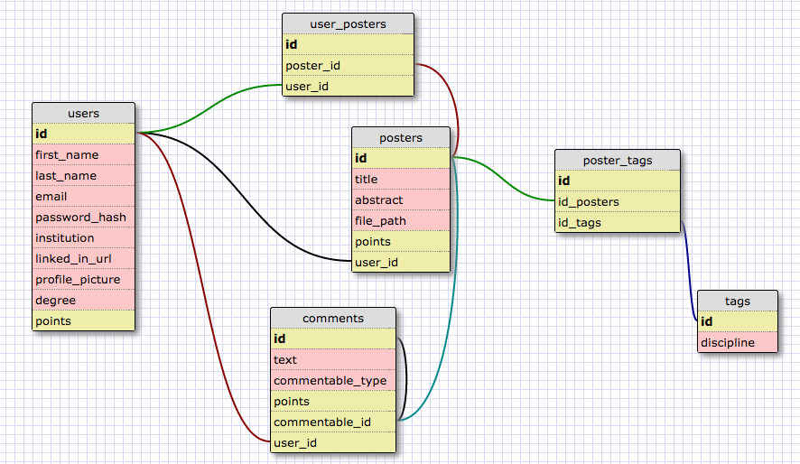

ScienceFair
============

ScienceFair offers researchers in all scientific disciplines to share their posters. It allows anyone to browse posters by subject or author and leave feedback or questions. Essentially, ScienceFair seeks to broaden the dialogue from from a traditional poster session, during which presentations last only a few minutes. ScienceFair provides researchers the opportunity to broaden the audience that sees their posters, without spending hundreds of dollars to travel to research conferences.

System Requirements
- (Ruby version, PG version, Rails version, etc.)

External APIs and Libraries
- (insert magnifier here)

Getting Started
- Clone to local machine (insert command and git url)
- Bundle Install
- Run Server (rails s)
- Visit localhost:3000

General Style Guide
- All pages have (insert off-white color) background
- All accents are (insert cardinal red color)
- All buttons take the opposite color as their background (white for red background, red for white baclground)
- Text is black when on white background, white when on red background

Features

- Login
- Logout
- Create Account
- Create Poster
  - Upload Poster
  - Credit Authors
  - Tag Subjects
- Browse Posters
- View and Comment on Specific Poster
  - Can Zoom on Poster (thecodeplayer.com magnifier)
- Upvotes
  - Posters
  - Users
  - Authors
  - Comments
- Workshop
  - Edit with Google
    - Google drive integration
  - View/Leave Feedback
- Chat While Viewing a Poster
- Audio/Visual Uploads
- Institution Suggestions
- Responsive

Style Guide

Background - off-white (eggshell)
  Text - black
Accents/Header - cardinal red
  Text - off-white (eggshell)
Flat Buttons
Calibri
Layouts
  Persistent header (except zoomed view)
  Pages with Multiple Posters
    Two columns, one poster per
  Pages with One Poster
    Two columns (3/4 and 1/4)
  Anytime a poster image is clicked, it takes up the whole screen
  Profile Page
  Links
    Every poster picture links to its page
    Every username links to user's profile
    Every tag links to that discipline's page

Pages
  Root/Index Page (Multiple Poster Partial)
  Single Poster View
  Category Poster View (Multiple Poster Partial)
  User Profile (Multiple Poster Partial)

